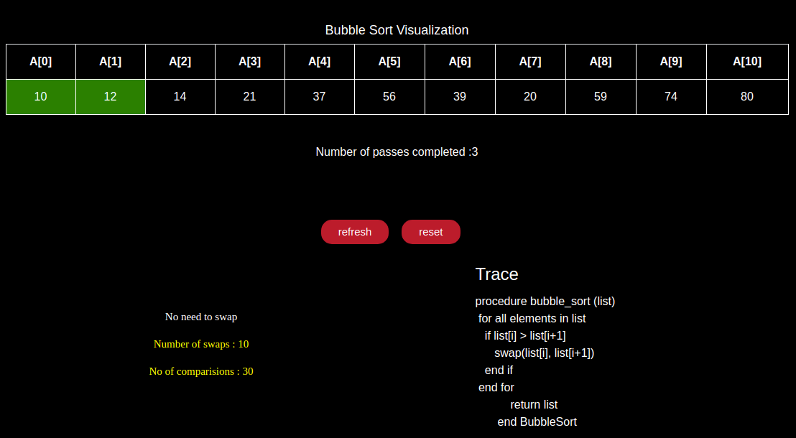

# Algovis
 

Algovis, An Experiment to visualize the algorithms imitating the conventional classroom teaching approach. 
Visualizations are dynamic in a way that enables any novice student to understand the algorithms effectively.
 
 

Algorithm visualizations currently available:  
1. Linear search
2. Binary search
3. Bubble sort
4. Optimized Bubble sort
5. Merge sort 
6. Insertion sort (Under Development)
7. Selection sort (Under Development)
8. K Means Clustering

You can download the code from this repository  
Download the zip and extract it. 
Run the index.html and you are good to go without any other requirements. 
Feel free to experiment and change a line of code here and there and see what changes happen.  

#### If stuck ?
1. If the animation is stuck or not starting, then clear the cache of the browser and restart the browser.
2. Even then if it does not work then try using a different browser.

<h5>NOTE :</h5> 
<b> 

1. All visualizations are tested in various browsers. All visualizations work perfectly except the merge sort in firefox browser due to its internal bug.</b>
 
2. K means clustering visualization was taken from here : https://github.com/hckr/k-means-visualization .

You can see the visualizations at   https://chiranjeevikarthik.me/Algovis/

#### Update:
1. Several Cheatsheets for various subjects are added. (May 2019).  
2. A new Dataset section is added. (Jun 2019).

#### Screenshots :

   
   
   
